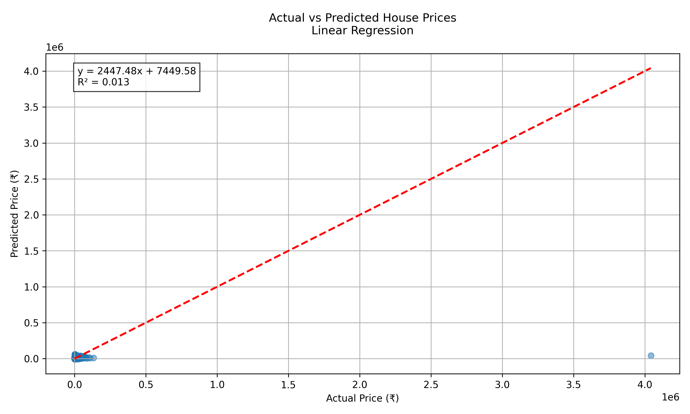

# House Price Prediction using Linear Regression

This project implements a **Linear Regression** model to predict house prices based on historical housing data. The goal is to demonstrate how simple regression techniques can effectively analyze and forecast real estate prices.

---

## Table of Contents
- [Overview](#overview)
- [Dataset Description](#dataset-description)
- [Technologies Used](#technologies-used)
- [Installation](#installation)
- [Exploratory Data Analysis (EDA)](#exploratory-data-analysis-eda)
- [Visualizations](#visualizations)
- [Conclusion](#conclusion)
- [Future Improvements](#future-improvements)

---

## Overview
We use **Linear Regression** to predict house prices using features such as:
- Area (sq. ft.)
- Number of bedrooms/bathrooms
- Year built
- Garage size
- Living area

**Evaluation Metrics**:
- R² Score
- Mean Absolute Error (MAE)
- Root Mean Squared Error (RMSE)

---

## Dataset Description
**Columns**:
| Feature      | Description                          |
|--------------|--------------------------------------|
| `LotArea`    | Total lot area (sq. ft.)             |
| `YearBuilt`  | Construction year                    |
| `Bedrooms`   | Number of bedrooms                   |
| `Bathrooms`  | Number of bathrooms                  |
| `GarageArea` | Garage size (sq. ft.)                |
| `LivingArea` | Above-ground living area (sq. ft.)   |
| `Price`      | Target variable (USD)                |

 **File**: `data/housing_data.csv`

You May also download the dataset from Kaggle: https://www.kaggle.com/datasets/juhibhojani/house-price?resource=download

---

## Technologies Used
- **Python 3.x**
- **Libraries**:
  - `NumPy`, `Pandas` (Data handling)
  - `Scikit-learn` (ML model)
  - `Matplotlib`, `Seaborn` (Visualizations)
- **IDE**: Jupyter Notebook / VS Code / PyCharm

---

## Installation
1. Clone the repository:
   ```bash
   git clone https://github.com/your-username/House-Price-Prediction.git
   cd House-Price-Prediction
   ## Install dependencies:

2. Install dependencies:
   ``` bash
     pip install -r requirements.txt
   ```

3. How to Run:
    ``` bash
     python House_Price_Model.py
   ```
---
## Exploratory Data Analysis (EDA)

- Correlation Heatmap: Shows the correlation between numeric features and house price.

- Distribution Plot: Checks for skewness in target variable.

- Scatter Plot: Shows how features like Living Area or Garage Area relate to price.

---
## Model Training

- Train/Test split: 80/20  
- Feature scaling is used where required  

### Model Evaluation
- **Mean Absolute Error (MAE)**
  
- **Mean Squared Error (MSE)**

    
- **Root Mean Squared Error (RMSE)**
  
- **R² Score (Goodness of Fit)**
---

## Visualizations


## Key Insights

- The plot shows predicted house prices vs actual prices with a regression line.
- The red dashed line represents the model’s best linear fit.
- Most data points are scattered far from the line, showing weak predictions.
- A very low R² score (≈ 0.01) indicates the model barely explains the variation in prices.
- Outliers are pulling the line away from the majority of points, reducing accuracy.
- This suggests the model needs better features or a different algorithm to improve performance.

  ---
  

## Conclusion
- Linear Regression is effective for predicting housing prices when proper features are selected.

- Good accuracy for initial models, with scope to improve using feature engineering or advanced algorithms.

- Visuals confirm randomness in residuals → Linear Regression assumption holds well.
  
---

## Future Improvements
-We may add more meaningful features like:

  - Zip Code

  - School rating

  - Neighborhood ranking

- Use Polynomial Regression or Random Forest Regressor for comparison

-Deploy the model with Flask or Streamlit

---

## Acknowledgements
Dataset inspired from Kaggle housing price datasets

Libraries: Scikit-learn, Pandas, Seaborn, Matplotlib

---

## Contact
Feel free to reach out on LinkedIn or open an issue.
   
